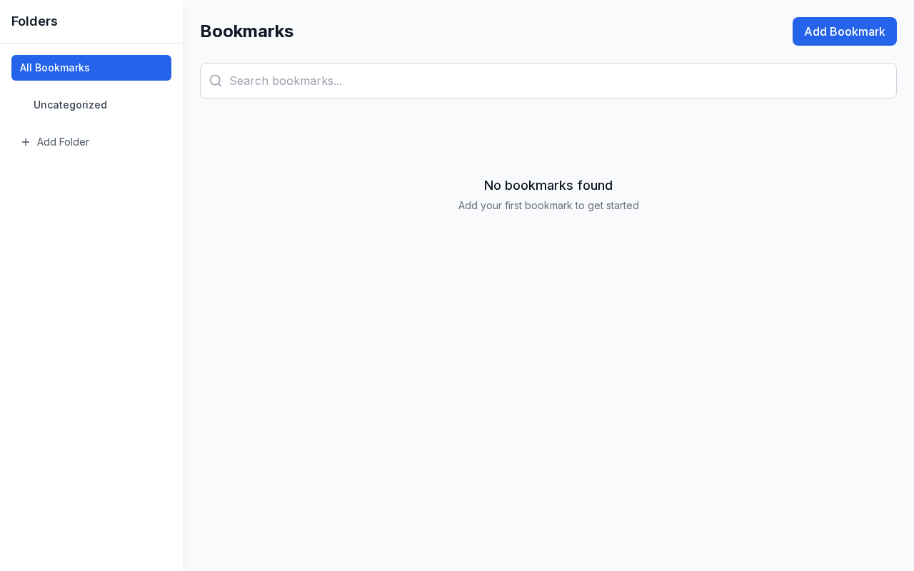

# Bookmark Manager

> Built with [Dark Factory v4](https://github.com/ibuzzardo/dark-factory-v4) — autonomous AI software development pipeline

**[Live Demo](https://bookmark-manager-ibuzzardos-projects.vercel.app)**


A modern bookmark manager built with Next.js 15, TypeScript, and Tailwind CSS. Organize your bookmarks with folders and tags, search across all content, and keep everything synced with localStorage.





## Features

- 📚 **Save bookmarks** with automatic metadata fetching
- 📁 **Organize with folders** - create custom folders to categorize bookmarks
- 🏷️ **Tag system** - add color-coded tags for cross-folder organization
- 🔍 **Full-text search** - search across titles, URLs, descriptions, and tags
- 📱 **Responsive design** - works seamlessly on desktop and mobile
- 💾 **Local storage** - all data persists in your browser
- 🚀 **Fast and modern** - built with Next.js 15 App Router


## Tech Stack

- Next.js 15, TypeScript, Tailwind CSS
- shadcn/ui component library
- Lucide icons

## Getting Started

### Prerequisites

- Node.js 18+ 
- npm

### Installation

1. Clone the repository:
```bash
git clone <repository-url>
cd bookmark-manager
```

2. Install dependencies:
```bash
npm install
```

3. Start the development server:
```bash
npm run dev
```

4. Open [http://localhost:3000](http://localhost:3000) in your browser

## Usage

### Adding Bookmarks

1. Click the "Add Bookmark" button
2. Enter a URL - the app will automatically fetch the page title and description
3. Choose a folder and add tags (optional)
4. Click "Add Bookmark"

### Managing Folders

- Use the sidebar to navigate between folders
- Click "Add Folder" to create new folders
- Delete folders by hovering over them and clicking the trash icon
- Bookmarks from deleted folders are moved to "Uncategorized"

### Searching and Filtering

- Use the search bar to find bookmarks by title, URL, description, or tags
- Click on tag pills to filter bookmarks by specific tags
- Click on folders in the sidebar to view bookmarks in that folder
- Click "All Bookmarks" to see everything

## API Routes

The app includes a full REST API:

- `GET /api/bookmarks` - List all bookmarks (supports ?folder, ?tag, ?q query params)
- `POST /api/bookmarks` - Create new bookmark
- `PUT /api/bookmarks/[id]` - Update bookmark
- `DELETE /api/bookmarks/[id]` - Delete bookmark
- `GET /api/folders` - List all folders
- `POST /api/folders` - Create new folder
- `DELETE /api/folders/[id]` - Delete folder
- `GET /api/tags` - List all tags

## Development

### Scripts

- `npm run dev` - Start development server
- `npm run build` - Build for production
- `npm run start` - Start production server
- `npm run lint` - Run ESLint
- `npm run type-check` - Run TypeScript type checking

### Project Structure

```
src/
├── app/
│   ├── api/           # API routes
│   ├── globals.css    # Global styles
│   ├── layout.tsx     # Root layout
│   └── page.tsx       # Home page
├── components/        # React components
├── lib/
│   ├── store.ts       # Data store with localStorage
│   ├── types.ts       # TypeScript interfaces
│   └── validators.ts  # Zod schemas
```

### Technologies Used

- **Next.js 15** - React framework with App Router
- **TypeScript** - Type safety and better DX
- **Tailwind CSS** - Utility-first CSS framework
- **Zod** - Schema validation
- **Lucide React** - Icon library

## Data Storage

All data is stored locally in your browser's localStorage. This means:

- ✅ Your data stays private and local
- ✅ No account required
- ✅ Works offline
- ⚠️ Data is tied to your browser/device
- ⚠️ Clearing browser data will remove bookmarks

## Contributing

1. Fork the repository
2. Create a feature branch
3. Make your changes
4. Add tests if applicable
5. Submit a pull request

## License

MIT License - see LICENSE file for details